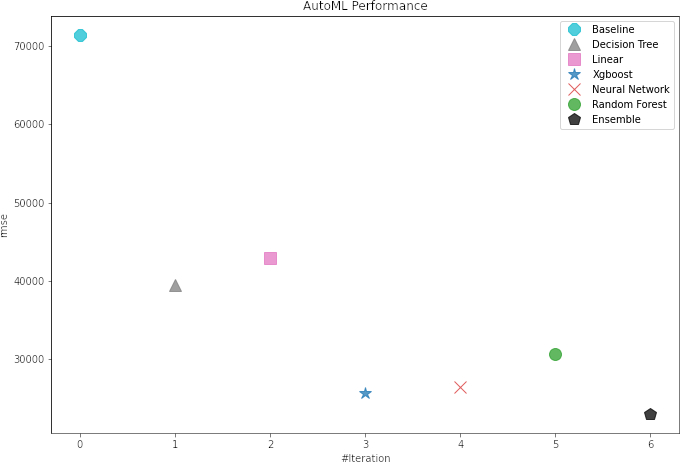

## Estimating house 🏠 prices 💸 in Iowa's (USA) Ames residential area

#### Goal: 
to compare AutoML (prepared using MLjar) and manual ML (completed using Scikit-learn) approaches to house prices estimation; with the focus on functionality, not finding the most accurate algorithm 

#### Data:
Ames house features and prices, originally prepared by Dean De Cock, later modified by Kaggle. Data are accessible at: https://www.kaggle.com/c/house-prices-advanced-regression-techniques/data

#### Personal opinions:
1. MLjar is a great AutoML tool suitable for processing tabular data. It is easy to use, rich in features and well-documented.
2. AutoML can serve as a prototyping tool in the early stages of the project as it allows for quick decisions on:
- whether the relationship between explanatory features and the target exist
- if so, what is its approximate nature - which directions (types of algorithms) should be further tested
3. MLjar speeds up the pre-processing, training and partly evaluation stages (some plots/metrics are prepared as default, and fortunately we can create additional ones freely, as all the raw outputs and parameters are saved).
  Still, in order to build the reasonable solution, an extensive EDA joined with detailed results' evaluation should be done. 
